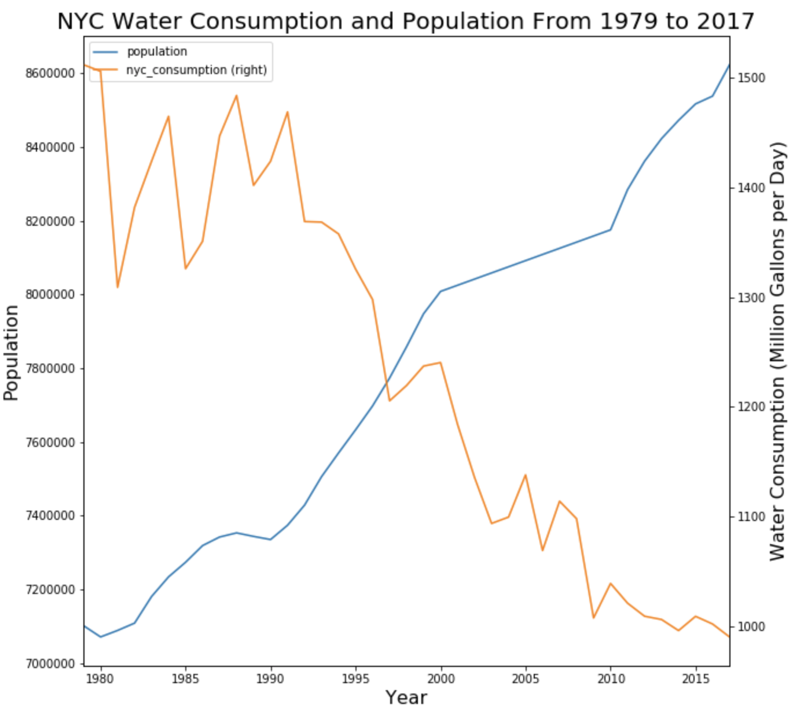

Figure 1: The consumption of the water decreases as the population of NYC growing over the years

This shows that NYC is using less water per person every year

# Review:

Guanjia chose an interesting topic about the relationship between water consumption and population in New York. This plot is easy to read and understand. The graphical elements used appropriately to represent the quantities being visualized and the graphical choices allowing you to focus on the right elements.

But it is a little confusing that it may lead us to mistake the rates of change of these 2 variables. The slopes of these 2 lines seem similar. However, the population increases about 50% while the water consumption only decreases about 20% actually. In a word, I suggest adjusting the scale of the y-axis.

Secondly, as for the color, I suggest exchanging the colors of the 2 lines. Water consumption: Blue, and population: orange. This because 'water' is represented by blue in common sense.

Final suggestion: convert population number into million so that it will be easier for the reader to understand. And it will be corresponding to the water consumption unit - 'million gallons per day'.